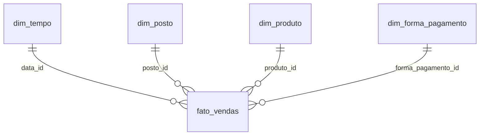

# BI Governance Toolkit


Kit de suporte e governança para um ambiente **Power BI Service**: um cliente
para a Power BI REST API, auditoria automática de workspaces, relatório de
acessos, uma biblioteca de medidas DAX e um dashboard de vendas — tudo sobre
um esquema estrela de dados sintéticos de uma rede de postos de combustível.

Este projeto nasceu ao ler uma vaga de suporte/administração Power BI (Power
BI Service, workspaces e acessos, governança de relatórios/datasets, DAX
básico, SQL básico, modelagem de dados) e decidir construir, em código
testável, o que essa rotina realmente envolve — não só um relatório bonito,
mas a parte de administração que normalmente fica invisível.

## Por que não um `.pbix`?

Um arquivo `.pbix` é binário: não dá para revisar em `git diff`, não roda em
CI, não é testável com `pytest`. Este projeto separa as duas partes que
importam:

- **O que é dado/lógica de negócio** (esquema estrela, ETL, medidas, regras
  de governança) mora em texto versionado — SQL, Python, `.dax`.
- **O que é apresentação** tem duas saídas equivalentes: as medidas DAX em
  `dax/medidas.dax`, prontas para colar num relatório Power BI Desktop real,
  e um dashboard Streamlit (`src/bi_toolkit/dashboard/app.py`) que lê o
  mesmo banco e mostra os mesmos números — para quem for rodar o projeto
  sem ter o Power BI Desktop instalado.

## Estrutura

```
├── sql/schema.sql                 # esquema estrela (fato + dimensões + views)
├── dax/medidas.dax                # biblioteca de medidas DAX comentada
├── docs/
│   ├── modelo_dados.md            # diagrama ER + racional do modelo
│   ├── nomenclatura.md            # padrões de nome (workspace/dataset/relatório/medida)
│   ├── governanca.md              # camadas de workspace, papéis, checklist, cadência de revisão
│   └── runbook_administracao.md   # procedimentos operacionais passo a passo
├── src/bi_toolkit/
│   ├── etl/                       # gerador de dados sintéticos + loader SQLite
│   ├── governanca/                # cliente Power BI REST API, auditoria, relatório de acessos
│   └── dashboard/                 # app Streamlit (KPIs e gráficos)
├── scripts/setup_dados.py         # gera o banco de exemplo com um comando
└── tests/                         # pytest — ETL, governança e dashboard
```

## Como funciona cada peça (e a que requisito da vaga responde)

| Módulo | O que faz | Requisito típico da vaga |
|---|---|---|
| `governanca/powerbi_client.py` | Autentica (service principal) e chama a Power BI Admin REST API | Administração do Power BI Service |
| `governanca/auditoria_workspaces.py` | Verifica nomenclatura, workspace pessoal, ausência de admin, capacidade | Governança de workspaces/acessos |
| `governanca/relatorio_acessos.py` | Lista quem tem acesso a quê, sinaliza domínios externos | Monitoramento de uso da plataforma |
| `sql/schema.sql` + `etl/` | Esquema estrela, geração e carga de dados | Modelagem de dados básica, SQL |
| `dax/medidas.dax` | Medidas prontas (vendas, margem, MTD, YoY, ranking) | Noções de DAX |
| `dashboard/app.py` | KPIs e gráficos executivos | Criação de relatórios e dashboards |
| `docs/` | Padrões de nomenclatura, políticas, runbook | Documentação de padrões e boas práticas |

## Modelo de dados



Detalhes completos, incluindo o porquê de cada decisão, em [`docs/modelo_dados.md`](docs/modelo_dados.md).

## Rodando localmente

```bash
python -m venv .venv
.venv/Scripts/activate        # Windows; use `source .venv/bin/activate` no Linux/Mac
pip install -r requirements-dev.txt

# gera o banco SQLite de exemplo (dados sintéticos, sem informação real)
python scripts/setup_dados.py

# sobe o dashboard
streamlit run src/bi_toolkit/dashboard/app.py
```

Ou via Docker:

```bash
docker compose up --build
```

O dashboard fica em `http://localhost:8501`.

### Rodando os testes

```bash
pytest -v --cov=bi_toolkit --cov-report=term-missing
ruff check src tests scripts
```

### Usando o módulo de governança contra um tenant real

Preencha um `.env` a partir de `.env.example` com as credenciais de um App
Registration do Azure AD com permissão de leitura na Power BI Admin API, e
siga os comandos em [`docs/runbook_administracao.md`](docs/runbook_administracao.md).
Sem credenciais reais, o módulo é validado pelos testes com respostas HTTP
mockadas (`tests/test_governanca.py`).

## Dados

Todo o dataset é **sintético**, gerado com seed fixa (`src/bi_toolkit/etl/gerar_dados.py`)
— nenhuma informação real de nenhuma empresa. Os nomes de postos, cidades e
o tema "rede de postos de combustível" foram escolhidos por proximidade com
o domínio de negócio da vaga que motivou este projeto, não por acesso a
dados de nenhuma empresa específica.

## Licença

[MIT](LICENSE)
