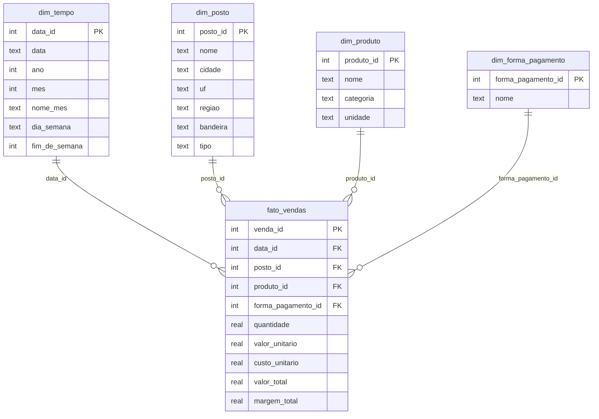

# Modelo de dados

Esquema estrela (`sql/schema.sql`) para vendas de uma rede de postos de combustível.
Grão do fato: **uma linha por posto, produto e dia** (uma venda agregada diária, não por transação de PDV individual).

## Por que esse desenho

- **Estrela, não floco de neve**: dimensões desnormalizadas (`dim_posto` já carrega cidade/UF/região) para reduzir joins no Power BI e deixar as medidas DAX simples.
- **`dim_tempo` própria**: em vez de usar a coluna de data direto no fato, uma dimensão de tempo permite marcar "Tabela de datas" no Power BI e habilita as funções de time intelligence usadas em `dax/medidas.dax` (MTD, YoY, etc.).
- **Granularidade diária agregada**: suficiente para os relatórios gerenciais do dashboard sem o volume de uma tabela transacional linha a linha — troca-off comum em modelos de BI departamentais.
- **Chaves substitutas inteiras** (`*_id`) em vez de chaves naturais: junções mais rápidas e mais robustas a mudança de nome/descrição na origem.

## Views de apoio

- `vw_vendas_mensais`: pré-agrega receita/margem/volume por posto e mês — usada quando o relatório precisa de granularidade mensal sem recalcular do fato toda vez.
- `vw_margem_por_bandeira`: margem percentual por bandeira, usada na auditoria de performance por franquia (ver `runbook_administracao.md`).

## Extensão futura (fora do escopo atual)

Uma tabela `dim_meta_vendas` (metas por posto/mês) permitiria medidas de "% da meta atingida" — não implementada porque não há origem de dados de metas neste projeto de portfólio.
